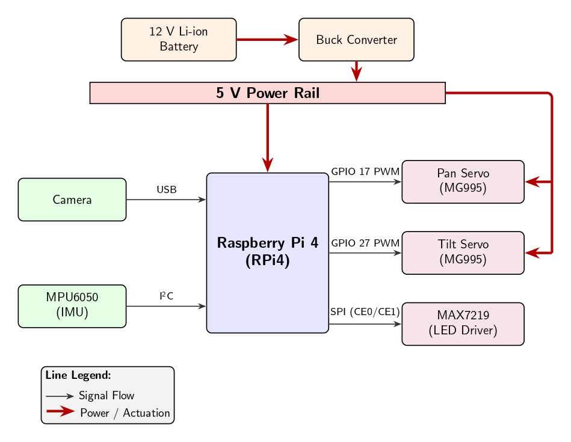
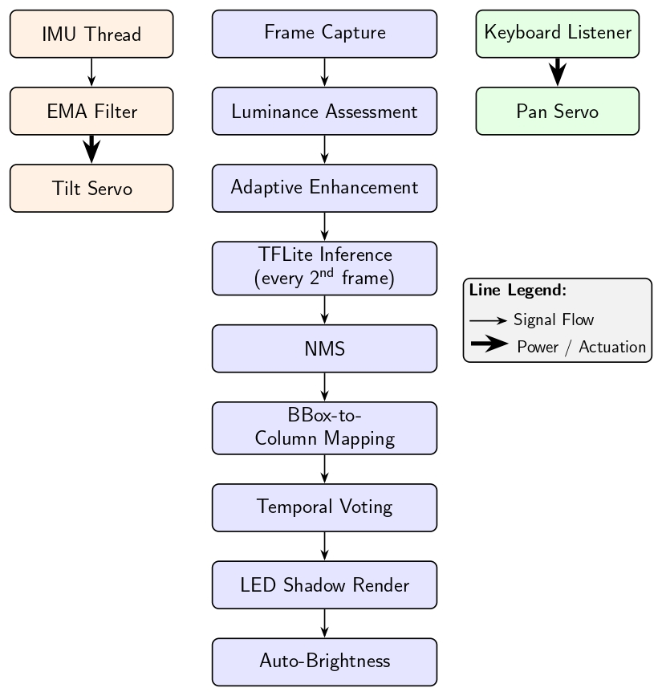
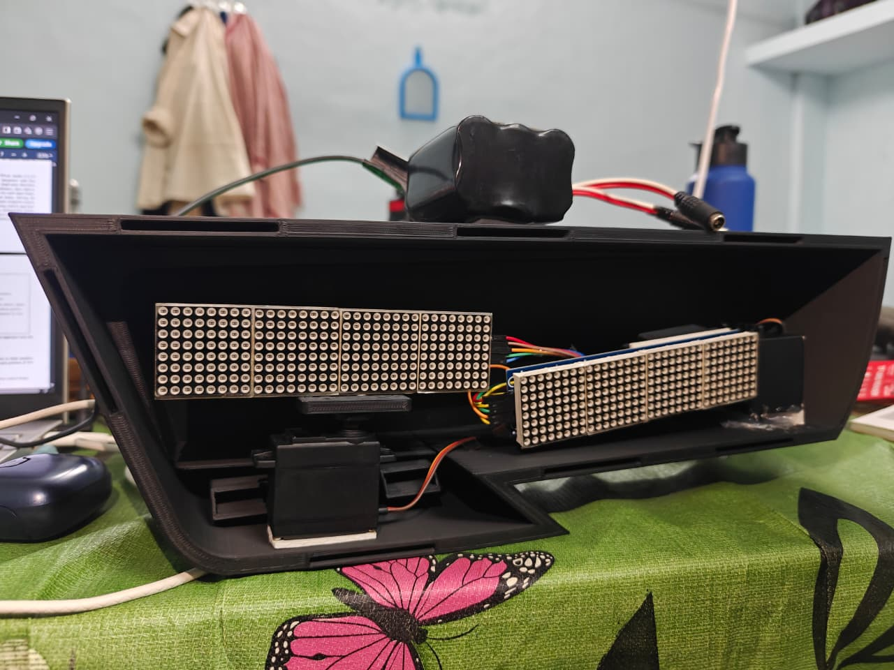
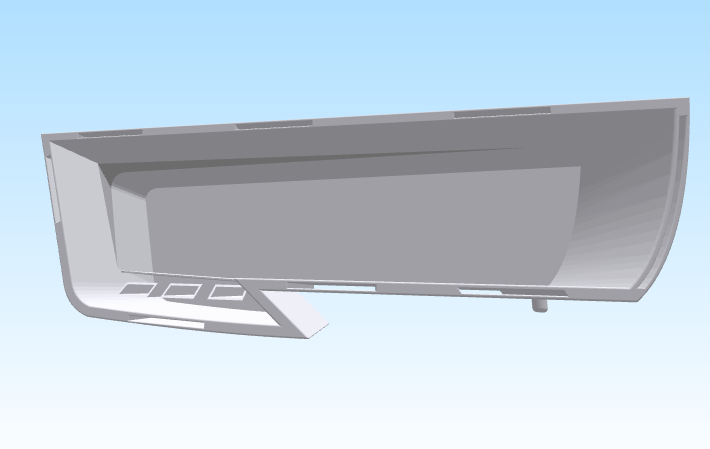
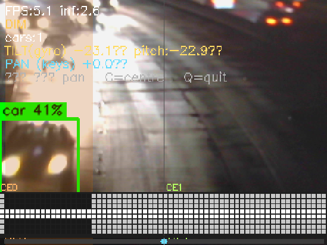

<h1>🚗 Edge-Based Adaptive Headlight System</h1>

  

Real-Time Vehicle Detection · Active Beam Masking · IMU-Driven Stabilization
A proof-of-concept adaptive front-lighting system built entirely on commodity embedded hardware — replicating commercial AFS technology at under ₹6,100.

 Amrita School of Engineering, Coimbatore · Amrita Vishwa Vidyapeetham

## 📋 Table of Contents
* [Overview](#-overview)
* [Demo](#-demo)
* [System Architecture](#-system-architecture)
* [Hardware](#-hardware)
* [Software Pipeline](#-software-pipeline)
* [Results](#-results)
* [Getting Started](#-getting-started)
* [Limitations & Future Work](#️-limitations--future-work)
* [Authors](#-authors)
* [References](#-references)

## 🔍 Overview
Road accidents caused by high-beam glare are a persistent safety concern — NHTSA data shows that while only 25% of travel occurs at night, approximately 50% of all traffic fatalities happen during dark hours. In India alone, over 224,000 road crashes occurred between 6 PM and 6 AM in a single year.

Commercial Adaptive Front-Lighting Systems (AFS) solve this with selective beam masking, but they rely on bespoke silicon and proprietary software stacks, placing them far outside the cost range of researchers, retrofit markets, and developing economies.

This project demonstrates that the full sensing → inference → actuation pipeline required for adaptive headlight operation is achievable on commodity hardware:

| Feature | Implementation |
| :--- | :--- |
| 🔦 Selective Glare Suppression | Real-time LED column masking per detected vehicle |
| 📐 Vertical Tilt Compensation | Autonomous pitch correction via MPU6050 IMU |
| ↔️ Lateral Pan Steering | Keyboard-driven beam steering (±20°) |
| 🌙 Adaptive Brightness | Auto-contrast scaled to ambient luminance |
| 🧠 On-Device Inference | Quantised MobileNet-SSD TFLite, no cloud dependency |

## 🎬 Demo

  
   Click the image to watch the video demonstration

## 🏗️ System Architecture
### Block Diagram

 Fig. 1 — Hardware architecture: Raspberry Pi 4 orchestrating camera, IMU, servos, and LED array

### Processing Pipeline

 Fig. 2 — Closed-loop pipeline: Frame Capture → Enhancement → TFLite Inference → NMS → Column Mapping → Temporal Voting → LED Render

The system operates as a closed-loop pipeline:

    ┌─────────────────────────────────────────────────────────────────┐
    │                        MAIN LOOP (30 fps)                        │
    │                                                                   │
    │  Frame Capture → Luminance Assessment → Adaptive Enhancement     │
    │        ↓                                                          │
    │  TFLite Inference (every 2nd frame) → NMS                        │
    │        ↓                                                          │
    │  BBox → Column Mapping → Temporal Voting → LED Shadow Render     │
    │        ↓                                                          │
    │  Auto-Brightness                                                  │
    └─────────────────────────────────────────────────────────────────┘

    ┌─────────────────────┐        ┌──────────────────────┐
    │    IMU THREAD        │        │  KEYBOARD LISTENER   │
    │  MPU6050 @ 20 Hz    │        │  ← →  Pan Servo      │
    │  EMA Filter → Tilt  │        │  C = Centre, Q = Quit│
    └─────────────────────┘        └──────────────────────┘

## 🔧 Hardware
### Complete Assembly

 Fig. 3 — Complete proof-of-concept prototype assembly

### 3D-Printed Headlight Housing

 Fig. 4 — Custom in-house FDM-printed headlight housing integrating both LED modules

The housing was designed entirely in-house using CAD software and fabricated via Fused Deposition Modelling (FDM) 3D printing, providing:
* Side-by-side mounting for both MAX7219 LED modules
* Mechanical linkage points for pan and tilt servo arms
* Forward aperture for collimated beam output

### Bill of Materials

| Component | Qty | Unit Cost (INR) |
| :--- | :--- | :--- |
| Raspberry Pi 4 Model B (4 GB) | 1 | 2,900 |
| MAX7219 32×8 LED Matrix Module | 2 | 350 |
| MG995 Metal Gear Servo Motor | 2 | 400 |
| MPU6050 IMU Breakout Module | 1 | 150 |
| 12V/5V DC-DC Buck Converter | 1 | 150 |
| 12V Lithium-Ion Battery | 1 | 850 |
| USB Camera Module | 1 | 650 |
| 3D-Printed Housing (filament) | 1 | 250 |
| Misc. (wiring, connectors) | — | 400 |
| **Total** | | **~₹6,100** |

### Pin Connections

| Signal | GPIO Pin | Component |
| :--- | :--- | :--- |
| Pan Servo PWM | GPIO 17 | MG995 (Lateral) |
| Tilt Servo PWM | GPIO 27 | MG995 (Vertical) |
| SPI CE0 | SPI0 CE0 | MAX7219 Module (Left, cols 0–31) |
| SPI CE1 | SPI0 CE1 | MAX7219 Module (Right, cols 32–63) |
| I2C SDA/SCL | GPIO 2/3 | MPU6050 @ 0x68 |
| Camera | USB | V4L2 Camera |

## 💻 Software Pipeline
### Dependencies

    # Core inference runtime
    pip install ai-edge-litert

    # LED matrix driver
    pip install luma.led-matrix

    # Servo control (hardware PWM via pigpio)
    pip install gpiozero
    sudo pigpiod  # Must be running as daemon

    # IMU
    pip install mpu6050-raspberrypi

    # Vision & keyboard
    pip install opencv-python numpy pynput

### Key Algorithms
**1. Adaptive Image Enhancement**
Three preprocessing modes conditioned on mean scene luminance:

| Mode | Condition | Pipeline |
| :--- | :--- | :--- |
| Dark | Mean < 70 | Gamma (γ=0.45) + CLAHE + Denoising + Unsharp (1.4) |
| Dim | 70 <= Mean < 110 | Gamma (γ=0.65) + CLAHE + Unsharp (1.2) |
| Day | Mean >= 110 | Unsharp masking only (0.8) |

**2. Vehicle Detection**
Quantised INT8 MobileNet-SSD TFLite model with per-class confidence thresholds:

| Class | Threshold |
| :--- | :--- |
| Car | 0.40 |
| Motorcycle | 0.50 |
| Truck | 0.60 |
| Bus | 0.70 |

Inference runs on every 2nd frame (15 fps effective) with 4 threads, followed by NMS at IoU threshold 0.45.

**3. LED Column Mapping**
Bounding box horizontal extent [x1, x2] → 64-column logical array → split across CE0/CE1 modules:

    c1 = max(0, int(x1 * 64))
    c2 = min(64, int(x2 * 64) + 1)
    # c < 32  → CE0 (left module)
    # c >= 32 → CE1 (right module, offset by 32)

**4. Temporal Majority-Vote Smoothing**
A column is activated in the shadow set only if it appeared in ≥ 3 of the last 6 frames, eliminating single-frame false positives:
* Ring buffer: Nh = 6 frames
* Vote threshold: Vmin = 3
* Activation latency: ~100 ms @ 30 fps
* Clear latency: ~200 ms after vehicle exit

**5. LED Shadow Rendering**

    P(row, col) = ON   if row in {3, 4}     ← Protected central beam (ALWAYS ON)
                = ON   if no vehicle detected
                = ON   if col not in shadow_set
                = OFF  if col in shadow_set AND vehicle detected

Rows 3 and 4 (0-indexed) form a permanently protected central strip ensuring minimum safe forward illumination is never interrupted.

**6. IMU Pitch Estimation & EMA Filter**

    pitch = atan2(ay, sqrt(ax^2 + az^2)) * (180/pi)
    theta_filtered[n] = 0.35 * pitch[n] + 0.65 * theta_filtered[n-1]

Dead-zone: 1.5°, min update interval: 50 ms

## 📊 Results
### Performance Metrics

| Metric | Value |
| :--- | :--- |
| Camera capture rate | 30 fps |
| Effective detection rate | ~15 fps |
| Single inference latency | ~500 ms (Pi 4 processing bottleneck) |
| LED matrix update rate | ~30 Hz |
| IMU sampling rate | 20 Hz |
| Max tilt servo update rate | ~20 Hz |
| Pan servo step response | < 100 ms / 5° |
| Shadow voting activation time | ~100 ms (3 frames) |

### Software Preview

 Fig. 5 — Live preview: detection bounding boxes, shadow column overlay, LED grid state, and HUD (FPS, tilt, pan, mode)

### Observed Behaviours
* ✅ Shadow columns extinguished within ~100 ms of first reliable detection
* ✅ Protected central beam rows never interrupted across all tests
* ✅ Shadow region tracks lateral vehicle movement in real time
* ✅ Shadow clears within ~200 ms after vehicle exits frame
* ✅ Tilt servo correctly returns to neutral on horizontal restore
* ✅ Auto-brightness responds to ambient luminance transitions

## 🚀 Getting Started
### Prerequisites
* Raspberry Pi 4 Model B (4 GB recommended)
* Raspberry Pi OS 64-bit
* `pigpio` daemon compiled and installed
* Hardware connected per the pin table above

### Installation

    # 1. Clone the repository
    git clone [INSERT_YOUR_REPOSITORY_URL_HERE]
    cd adaptive-headlight-system

    # 2. Install Python dependencies
    pip install -r requirements.txt

    # 3. Start the pigpio daemon (required for hardware PWM)
    sudo pigpiod

    # 4. Download the TFLite model
    # Place detect.tflite and labelmap.txt in the model/ directory
    # (See model/README.md for download instructions)

    # 5. Run the system
    python main.py

### Keyboard Controls

| Key | Action |
| :--- | :--- |
| ← | Pan left (−5° per press, capped at −20°) |
| → | Pan right (+5° per press, capped at +20°) |
| C | Centre pan back to 0° |
| Q | Quit |

*Note: Keyboard input is global — no need to focus the preview window.*

### Configuration
Key parameters in `main.py`:

    MODEL_PATH   = "model/detect.tflite"   # TFLite model path
    CAMERA_INDEX = 0                        # Camera device index
    FRAME_W, FRAME_H = 320, 240            # Capture resolution
    INFER_EVERY  = 2                        # Run inference every N frames
    SHOW_PREVIEW = True                     # Enable/disable live preview window

    # Detection confidence thresholds
    CLASS_THRESHOLDS = {
        "car": 0.40, "motorcycle": 0.50,
        "truck": 0.60, "bus": 0.70,
    }

    # Servo limits
    MAX_PAN_ANGLE  = 20.0   # ±20° lateral range
    PAN_STEP_DEG   = 5.0    # Degrees per keypress
    TILT_DEAD_ZONE = 1.5    # Minimum angle change to trigger tilt update

## ⚠️ Limitations & Future Work
### Current Limitations

| Limitation | Impact |
| :--- | :--- |
| ~500 ms inference latency | Pi 4 processing bottleneck; insufficient for real-time motorway speeds |
| 64-column angular resolution | Coarse vs. hundreds of pixels in commercial matrix LEDs |
| Keyboard pan control | No real steering-angle sensor integration |
| Accelerometer-only pitch | Sensitive to linear acceleration during braking/cornering |

### Future Directions
* [ ] CAN-bus steering-angle sensor integration to replace keyboard pan
* [ ] Complementary / Kalman filter fusing gyroscope + accelerometer for robust pitch
* [ ] Custom high-density addressable LED PCB for finer beam shaping
* [ ] Pedestrian and cyclist detection class extension
* [ ] Hailo-8L NPU migration for sub-10 ms inference latency
* [ ] Weather-sealed outdoor enclosure fabrication
* [ ] Photometric benchmarking against UNECE Regulation No. 123 beam-class requirements

## 👥 Authors

| Name | Institution |
| :--- | :--- |
| [Aryan Jaljith]([INSERT_ARYAN_GITHUB_URL_HERE]) | Dept. of EEE, Amrita School of Engineering, Coimbatore |
| [Harish R](https://github.com/Hackyharish) | Dept. of EEE, Amrita School of Engineering, Coimbatore |
| [Karthik K]([INSERT_KARTHIK_GITHUB_URL_HERE]) | Dept. of EEE, Amrita School of Engineering, Coimbatore |
| [Shri Monesh]([INSERT_SHRI_GITHUB_URL_HERE]) | Dept. of EEE, Amrita School of Engineering, Coimbatore |

## 📚 References
1. UNECE, "Regulation No. 123 — Adaptive Front-Lighting Systems (AFS)," Official Journal of the EU, L 222, Aug. 2010.
2. A. G. Howard et al., "MobileNets: Efficient CNNs for Mobile Vision Applications," arXiv:1704.04861, 2017.
3. W. Liu et al., "SSD: Single Shot MultiBox Detector," ECCV 2016, LNCS vol. 9905, pp. 21–37.
4. Google LLC, "TensorFlow Lite," https://www.tensorflow.org/lite
5. M. Pedley, "Tilt Sensing Using a Three-Axis Accelerometer," NXP App Note AN3461, Rev. 6, 2013.
6. Analog Devices, "MAX7219/MAX7221 Datasheet," Rev. 6.
7. InvenSense Inc., "MPU-6000 and MPU-6050 Product Specification," Rev. 3.4, 2013.
8. R. Hull, "luma.led_matrix," GitHub, https://github.com/rm-hull/luma.led_matrix

Made with ❤️ at Amrita School of Engineering, Coimbatore>

